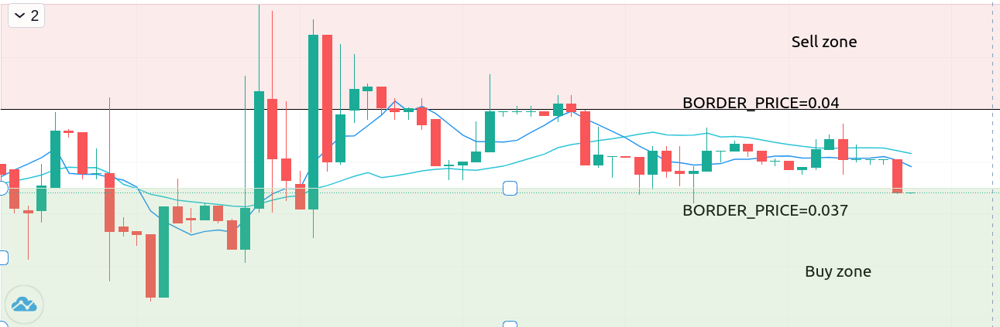

# CoinEx Api Client + Docker Trading bot

### Beginning

Access to the Coinex public API requires registration on the exchange, to obtain the ACCESS_ID and SECRET_KEY keys

Description of exchange endpoints [here](https://viabtc.github.io/coinex_api_en_doc/general/)

### Description



The bots in this example are configured to trade the EMC/USDT pair

The buyer bot is responsible for the range from 0.037 USDT per 1 EMC, the seller bot monitors the price range from 0.04

Both bots also monitor the balance of both assets in the account, and if it approaches the minimum, they will go into standby mode


### How to setup
Tasks for bots (buy or sell, price range) are transmitted via env files.
included in docker-compose.

Example .env

```env.example
ACCESS_ID=XXXXXX
SECRET_KEY=XXXXXX

TICKER=EMCUSDT
BORDER_PRICE=0.04
DIRECTION=sell

VERBOSITY=0
API_WAIT_TIME=0.1
HIDE=True
```

.env2 example
```env.example
ACCESS_ID=XXXXXX
SECRET_KEY=XXXXXX

TICKER=EMCUSDT
BORDER_PRICE=0.037
DIRECTION=buy

VERBOSITY=0
API_WAIT_TIME=0.1
HIDE=True
```


Where TICKER is a trading pair, DIRECTION is the trading direction (sell or buy), BORDER_PRICE is the cutoff price
, below or above which the bot will track the situation, but not trade.

You will need to follow the example to create 2 files, .env and .env2 (in the same directory as .env.example) for each of the bots: selling and buying
(see docker-compose.yaml)

### To start

Team
`docker-compose up -d`
runs bots in the sell_trader and buy_trader containers

Monitor the work of bots:

`docker-compose logs -f`


### Some features:

Bots place the minimum possible orders in the middle of the spread until the BORDER_PRICE limit is reached

The order is placed secretly, other participants on the exchange do not see it in the order book. (can be disabled in .env HIDE=False)

After placing an order, the bot starts tracking the order and the price. If the price is interrupted, the bot leaves the previous order and places a new one.
The bot tracks only the current order at the moment.

If the order is filled, the bot places another one. And so on, until the funds on the balance sheet run out.

In my opinion, this strategy performs well on flats with outliers. Those. allows you to use
a situation where the price shifts from a certain average range.


____

### Перед началом

Для доступа к публичному API Coinex требуется регистрация на бирже, для получения ключа ACCESS_ID и SECRET_KEY

Описание эндпоинтов биржи [тут](https://viabtc.github.io/coinex_api_en_doc/general/)

### Описание


Боты в данном примере настроены на торговлю парой EMC/USDT

Бот-покупатель отвечает за диапазон от 0.037 USDT за 1 EMC, Бот-продавец отслеживает диапазон цен от 0.04 

Также оба бота следят за балансом обоих активов в аккаунте, и если он приблизится к минимальному, перейдут в режим ожидания 


### Как настроить
Задание ботам (покупать или продавать, диапазон цен) передаются через env файлы.
подключаемые в docker-compose.

Пример .env

```env.example
ACCESS_ID=XXXXXX
SECRET_KEY=XXXXXX

TICKER=EMCUSDT
BORDER_PRICE=0.04
DIRECTION=sell

VERBOSITY=0
API_WAIT_TIME=0.1
HIDE=True
```

Пример .env2
```env.example
ACCESS_ID=XXXXXX
SECRET_KEY=XXXXXX

TICKER=EMCUSDT
BORDER_PRICE=0.037
DIRECTION=buy

VERBOSITY=0
API_WAIT_TIME=0.1
HIDE=True
```


Где TICKER это торговая пара, DIRECTION - направление торговли (sell или buy), BORDER_PRICE - цена отсечки
,ниже или выше которой бот отслеживать ситуацию, но не торговать.

Вам нужно будет по примеру создать 2 файла, .env и .env2 (в той же директории, что и .env.example)  для каждого из ботов: продающего и покупающего
(см docker-compose.yaml)

### Запуск

Команда 
`docker-compose up -d`
запускает ботов в контейнерах sell_trader и buy_trader

Следить за работой ботов:

`docker-compose logs -f`


### Некоторые особенности: 

Боты выставляют минимально возможные по объему ордера в середину спреда, пока не достигнуто ограничение BORDER_PRICE

Ордер выставляется скрытно, другие участники на бирже его не видят в стакане. (можно отключить в .env HIDE=False)

Поставив ордер, бот начинает отслеживать ордер и цену. Если цену перебили, бот оставляет предыдущий ордер и выставляет новый.
Бот отслеживает в моменте только текущий ордер.

Если ордер исполнен, бот выставляет еще один. И так далее, пока не закончатся средства на балансе.

По моему мнению, такая стратегия хорошо себя показывает на флэтах с выбросами. Т.е. позволяет использовать
ситуацию, когда цена каткорверменно смещается от некоторого среднего диапазона. 


